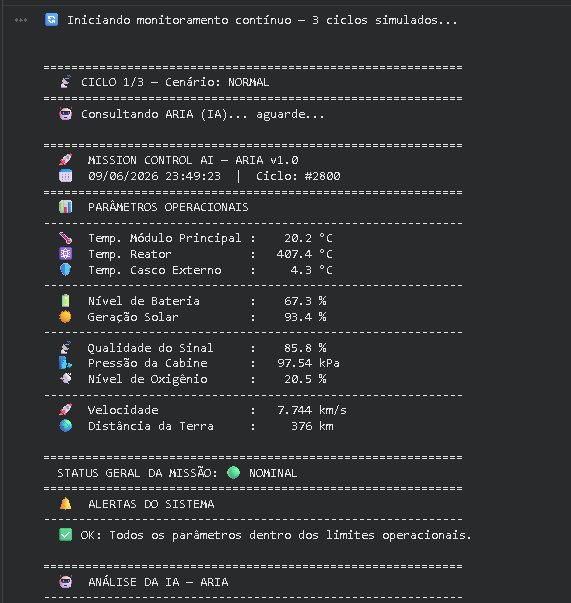
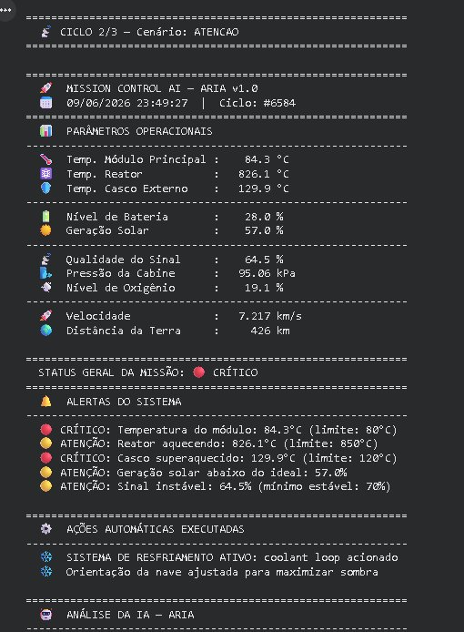
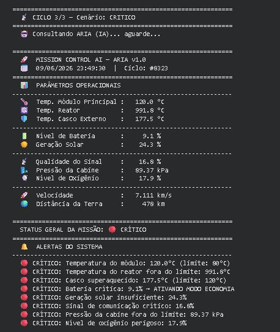
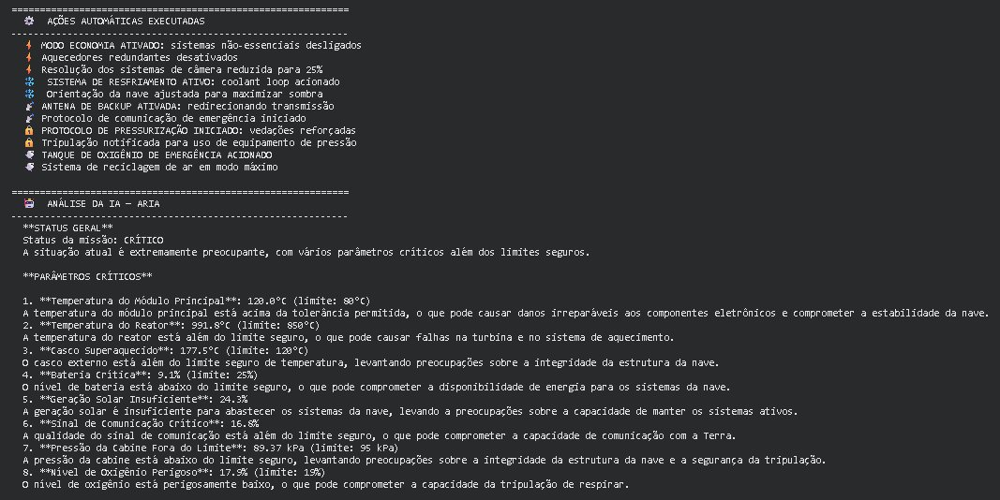
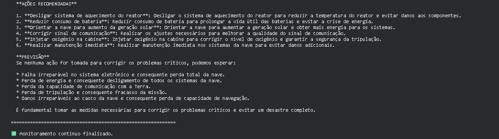

# 🚀 Mission Control AI

**Integrantes:**
- Rhuan Pacheco Carreri — RM: 570129
- Fabio Pena Vieira — RM: 570441

---

## 📋 O que o projeto faz

Sistema de monitoramento de missão espacial desenvolvido em Python no Google Colab. Usa o modelo de linguagem **Groq** (ARIA v1.0) para analisar em tempo real dados simulados de temperatura, energia, comunicação, pressão e oxigênio. O sistema classifica o status da missão em três níveis — **NOMINAL**, **ATENÇÃO** e **CRÍTICO** — e executa ações automáticas de resposta quando parâmetros ultrapassam os limites seguros.

---

## 🖥️ Demonstração

### Ciclo 1 — Cenário Normal
Todos os parâmetros dentro dos limites operacionais. Status: **NOMINAL**.

---

### Ciclo 2 — Cenário Atenção
Temperatura do casco elevada, bateria baixa e sinal instável. Status: **CRÍTICO** com alertas disparados e ações automáticas executadas.

---

### Ciclo 3 — Cenário Crítico
Múltiplos parâmetros fora do limite: temperatura, reator, bateria (9.1% → modo economia ativado), oxigênio e comunicação críticos. Status: **CRÍTICO**.

---

### Ações Automáticas Executadas
O sistema ativa respostas autônomas: modo economia, resfriamento ativo, antena de backup, tanque de oxigênio de emergência e mais.

---

### Análise da IA — ARIA
A IA analisa cada parâmetro crítico, fornece previsões e recomenda ações corretivas detalhadas.

---

## ⚙️ Tecnologias Utilizadas

- Python 3
- Google Colab
- [Groq API](https://groq.com/) — modelo de linguagem para análise da missão (ARIA v1.0)
- Bibliotecas: `groq`, `random`, `time`, `datetime`

---

## ▶️ Como Executar

Abra o notebook no Google Colab:

[Acessar Notebook](https://colab.research.google.com/drive/1z78M2lHKSQKkUgNky5AgWZMRfb8Dh-nj?usp=sharing)

Execute as células em ordem. Insira sua chave de API do Groq quando solicitado. O sistema irá simular automaticamente 3 ciclos de monitoramento — Normal, Atenção e Crítico.

---

## 🎥 Vídeo de Demonstração

[Assistir ao vídeo](#) <!-- Substitua pelo link real do vídeo -->

---

*FIAP — Global Solution 2026.1 | Prompt and Artificial Intelligence*
